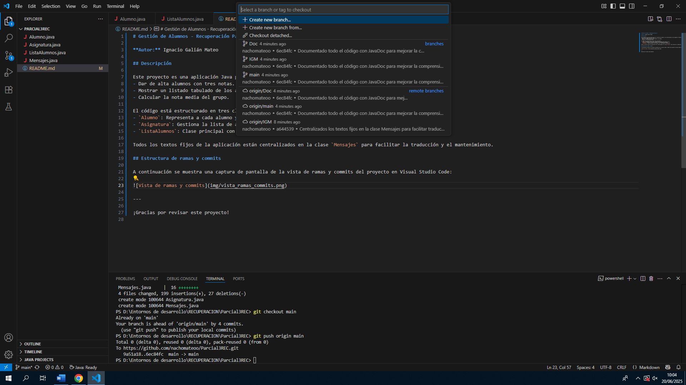

# Gestión de Alumnos - Recuperación Parcial 3

**Autor:** Ignacio Galián Mateo

## Descripción

Este proyecto es una aplicación Java para la gestión de alumnos y sus calificaciones en una asignatura. Permite:
- Dar de alta alumnos con tres notas.
- Mostrar un listado tabulado de los alumnos y sus medias.
- Calcular la nota media del grupo.

El código está estructurado en tres clases principales:
- `Alumno`: Representa a cada alumno y valida que las notas estén entre 0 y 10.
- `Asignatura`: Gestiona la lista de alumnos y las operaciones principales.
- `ListaAlumnos`: Clase principal con el método `main` que ejecuta la aplicación.

Todos los textos fijos de la aplicación están centralizados en la clase `Mensajes` para facilitar la traducción y el mantenimiento.

## Estructura de ramas y commits

A continuación se muestra una captura de pantalla de la vista de ramas y commits del proyecto en Visual Studio Code:

---

¡Gracias por revisar este proyecto!
